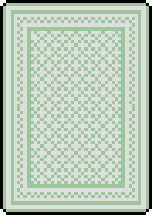

[](https://ktortolini.github.io/stu-side-project-01/)

# Random Cards

## _Description_

This repository has a random card game made using Javascript, as well as a valid HTML5 index file with Accessibility Attributes, and a valid CSS3 style sheet with a reset file for compatibility. The purpose of this repository is to show a high degree of creativity, and a general enthusiasm for making silly games on my free time, using such coding techniques as:

- Dynamic image sourcing to load a corresponding visual representation in the center of the screen, in order to show the card that has been drawn by the user.
- Dynamic styling applied with a `load` event in order to improve the visual appearance of the loading sequence.
- Conditional statements that handle user input, apply special game rules, apply the scores to the high-scores, and refill the deck of cards once all of the cards have been drawn.
- Various statements like `if()` statements, console logging using `console.log()` statements, 
- Comparison operators ( `<=`, `>=`, and `===` ), logical operators ( `&&` and `||`), and arithmetic operators ( `%`, `++` and `--` ).
- Multidimensional arrays to store the name and value of each card contained in a full deck of cards and reset the playing deck with a `const` two-dimensional array when all the cards have been drawn.

## _Usage_

The top of the screen will show your high-score and is achieved with the following `HTML` code:

```html
<nav>
	<!-- the high-score is also affected by a 'ul' selector in the css file that centers everything -->
	<ul>
		<li>High Score &colon;<span id="highscore"></span></li>
	</ul>
</nav>
```

The high-score is updated with the following `JS` code:

```js
// initiates the variable for the hig-score
var highscore = 0;

// when the player has drawn three cards the score is compared with the high-score
if (score > highscore) {

   highscore = score;

   // then the highscore is formatted using the statements below
   let formattedHighscore = highscore.toString().padStart(3, "0");
   document.getElementById("highscore").textContent = " " + formattedHighscore;

}
```

Underneath the high-score, the most recently drawn card will be shown, and this is achieved with the following `HTML` code:

```html
<!-- the games starts with a picture of a face-down card centered with the css file -->
<section class="card-container">
	
</section>
```

The picture is updated with the following `JS` code:

```js
// initiates the variable for the picture of the card
var cardPicture = document.getElementById("card");

// when the player hits the enter button or taps the screen a random card is drawn
function drawRandomCard(event) {

   if (event.code === "Enter" || event.type === "click") {

      // this is the method being used to select a random card
      let randomCard = Math.floor(Math.random() * totalCards.length);

      // the number that has been returned is used to find the name and value of the card
      let cardName = totalCards[randomCard][0];
      let cardValue = totalCards[randomCard][1];
      console.log("Card that you have drawn:", cardName);
      console.log("Value of the drawn card:", cardValue);

      // then the card name is used to find the corresponding picture
      cardPicture.src = "./assets/cards/" + cardName + ".png";

   }

}
```

Underneath the picture of the card is a blinking request for the player to hit the enter button on their keyboard or tap the screen on their mobile device. This effect is achieved with the following `CSS` code:

```css
@keyframes blink {

   0% {

      /* there is no effect in this frame */

   } 50% {

      /* effect is inserted in this frame */
      color: var(--black-color);

   } 100% {

      /* there is no effect in this frame */

   }

}

/* then the animation created above is applied to the id selector */
#prompt {

   /* the animation is played over and over */
   animation: blink 0.62s infinite;

}
```

Underneath the blinking request is the player's score achieved with the following `HTML` code:
```html
<!-- the score is also affected by a 'p' selector in the css file that centers everything -->
<p>
	Score &colon; <span id="score">000</span>
	<!-- future feature: player's will be able to add their name to a leader-board -->
	<span id="input-name"></span>
</p>
```

The score is updated with the following `JS` code:

```js
// initiates the variable for the score
const zeroScore = 0;
var score = 0;

// drawing a heart awards double points!
if (cardName.includes("Hearts")) {

   cardValue *= 2;

}

// the player's score gets additional points based on the value of the drawn card
score += cardValue;

// then the score is formatted using the statements below
let formattedScore = score.toString().padStart(3, "0");
document.getElementById("score").textContent = formattedScore;

// the statement below divides the number of draws by three
if (drawCount % 3 === 0) {
            
   // if the remainder is zero the code below is run
   setTimeout ( function() {

      let clearScore = zeroScore.toString().padStart(3, "0");

      console.log("Your limit has been reached.");
      console.log("Your final score:", score);

      document.getElementById("score").textContent = clearScore;

   }, 1000); // an argument is placed here of 1 second delaying the whole function

   // lastly, the score is reset
   score = zeroScore;

}
```

Well, that's the essence of what is happening when you play the game. There are plans to add more feature later on, but for now this is a game based solely on luck that isn't much fun. 🤷

But I had a lot of fun making it.
## _Credits_

The ITCH, JS, and GITHUB PAGES readme file icons on the top were made by [Ileriayo](https://github.com/Ileriayo) with a link provided below: https://github.com/Ileriayo/markdown-badges#badges. 

Tremendous thank you to [Androx](https://twitter.com/Paradox1821) for the asset pack used to create this mini project with the link provided below: https://byandrox.itch.io/pixel-art-poker-deck.

Incredible thank you to [Caffi_Nate](https://twitter.com/caffi_nate) for the font used throughout this mini project with the link provided below: https://caffinate.itch.io/abaddon.

There were a few helpful tutorials that guided me through this project. First, the multidimensional arrays tutorial by [JavaScriptTutorial](https://www.javascripttutorial.net/) was a great resource - link: https://www.javascripttutorial.net/javascript-multidimensional-array/. Next, the Javascript performance tutorial by [TapasAdhikary](https://www.tapasadhikary.com/) was another great resource - link here: https://www.freecodecamp.org/news/javascript-performance-async-defer/.